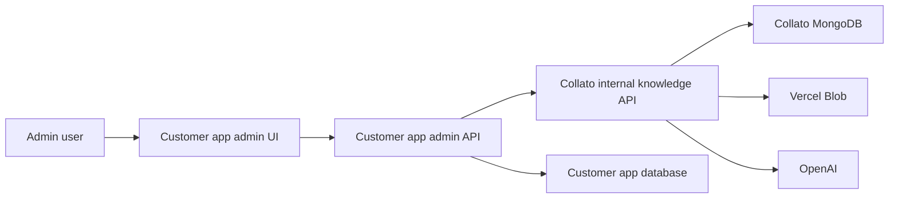

# Collato Integration Guide

Collato can run as an internal knowledge service for another application. The customer app keeps its own auth, UI, database, and business workflows. Collato receives server-to-server source records and files, turns them into searchable knowledge, and answers admin questions with source references.

Use these docs when integrating Collato into a customer app, or when asking an AI coding agent to do the integration.

## What Collato Provides

- Structured source ingestion from external app records such as orders, tickets, invoices, projects, policies, SOPs, CRM notes, or admin settings.
- File ingestion for durable reference material. Supported extraction currently covers text-like files, JSON/XML/CSV/Markdown, `.docx`, PDFs, and images via AI extraction.
- Embedding and chunking for tenant-scoped retrieval.
- Source-grounded answers that cite retrieved source records.
- Source listing so the customer app can show what has been indexed.
- Delete handling so records removed from the customer app can be removed from Collato retrieval.

## Recommended Architecture

The browser should never call Collato directly.

Customer app responsibilities:

- Own sign-in, role checks, and native admin UI.
- Keep Collato credentials on the server only.
- Proxy admin knowledge actions through customer app API routes.
- Sync important writes to Collato after business writes succeed.
- Keep primary workflows successful even if Collato sync fails.

Collato responsibilities:

- Authenticate server-to-server calls with `COLLATO_INTERNAL_API_SECRET`.
- Store and index tenant-scoped source records.
- Extract text from uploaded files.
- Retrieve relevant chunks and generate grounded answers.

## Core Model

Every external item indexed into Collato is a knowledge source.

| Field | Meaning |
| --- | --- |
| `tenantSlug` | Customer/account namespace. Examples: `ggh`, `acme`, `client-42`. |
| `sourceApp` | Integrating app identifier. Examples: `ggh-code`, `acme-admin`. |
| `sourceType` | Domain category. Examples: `order`, `ticket`, `invoice`, `project`, `policy`, `sop`. |
| `sourceId` | Stable external ID. Recommended: `{tenantSlug}:{sourceType}:{id}`. |
| `title` | Human-readable source title shown in source lists and citations. |
| `text` | Searchable body. Usually a structured JSON or plain-text summary of the record. |
| `metadata` | Optional object for admin links, local IDs, status, owner, tags, or source-specific data. |
| `createdAt` | Source creation timestamp. |
| `updatedAt` | Source update timestamp. |
| `indexedAt` | Collato timestamp set when the source is indexed. |

Use stable `sourceId` values. Re-sending the same source identity replaces the previous source document and its retrieval chunks.

## Integration Flow

1. Deploy/configure Collato with MongoDB, OpenAI, Blob storage, and `COLLATO_INTERNAL_API_SECRET`.
2. Add customer app server env vars:
   - `COLLATO_INTERNAL_API_URL`
   - `COLLATO_INTERNAL_API_SECRET`
   - `COLLATO_TENANT_SLUG`
3. In Collato, open Organization Settings and create an Internal API key for the customer app.
4. Create a server-only Collato client helper in the customer app.
5. Add admin-only proxy routes for sources, query, files, and backfill.
6. Add a native admin knowledge UI in the customer app.
7. Add on-write sync after important create/update/status/payment flows.
8. Add delete sync for records removed from the customer app.
9. Add an idempotent backfill script and run it once before launch.
10. Verify access control, source citations, stale-record removal, and failure handling.

## Docs In This Folder

- [API Reference](./api-reference.md)
- [AI Agent Playbook](./agent-playbook.md)
- [Examples](./examples.md)
- [Security And Operations](./security-and-operations.md)

## Fast Acceptance Checklist

- Non-admin users cannot access the customer app knowledge UI or proxy routes.
- `COLLATO_INTERNAL_API_SECRET` is never sent to the browser.
- Missing Collato config is visible in the admin UI and does not break core business workflows.
- Backfill can be rerun without duplicate source identities.
- Updating a source replaces prior chunks for the same source.
- Deleting a source removes it from future answers.
- Query responses include source references.
